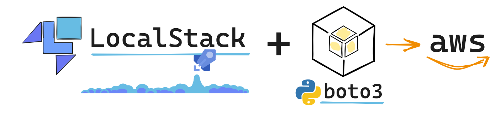

# Boto3 & LocalStudio




## What is localstack?

**Localstack** is a platform that provides a local version of several cloud services, allowing you to simulate a development environment with AWS services. This allows you to debug and refine your code before deploying it to a production environment. For this reason, Localstack is a valuable tool for emulating essential AWS services such as object storage and message queues, among others.

Also, **Localstack** serves as an effective tool for learning to implement and deploy services using a Docker container without the need for an AWS account or the use of your credit card. 
In this tutorial, we create a Localstack container to implement the main functionalities of S3 services.

---

## What is boto3?

**`Boto3`** is a 🐍 Python library that allows the integration with AWS services, facilitating various tasks such as creation, management, and configuration of these services.

There are two primary implementations within Boto3: 
* **Resource implementation**: provides a higher-level, object-oriented interface, abstracting away low-level details and offering simplified interactions with AWS services. 
* **Client implementation**: offers a lower-level, service-oriented interface, providing more granular control and flexibility for interacting with AWS services directly.


---

## Prerequisites
Before you begin, ensure that you have the following installed:

* 🐳 Docker
* 🐙 Docker Compose


---

### 🚀 Build and run the Docker Compose environment

#### 1. Clone the repository
 ```bash
   git clone https://github.com/r0mymendez/LocalStack-boto3.git
   cd LocalStack-boto3
```
#### 2. Build an run the docker compose 
  
`docker-compose -f docker-compose.yaml up --build`

---

### 🚀 Using LocalStack with Boto3: A Step-by-Step Guide
### 🛠️ Install Boto3

```!pip install boto3```

### 🛠️ Tutorial
Discover  the tutorial covering file creation, writing, and reading, also this tutorial has additional functionalities like building a static site, adding tags, and implementing versioning.

You will able to find the code in the 'boto3-tutorial.ipynb' notebook, which  you'll perform a simple exercise demonstrating how to fetch data from a public API and store it in an S3 bucket using LocalStack services.
